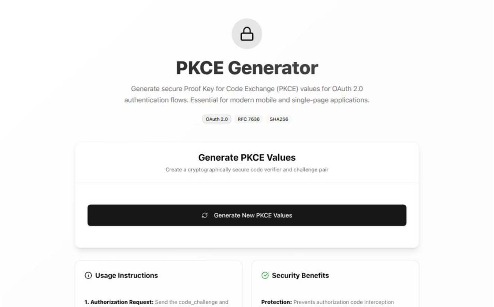

# PKCE Generator

A modern, secure PKCE (Proof Key for Code Exchange) generator for OAuth 2.0 authentication flows.



## 🚀 Features

- 🔒 **Cryptographically secure** random code verifier generation
- 🔄 **SHA256-based** code challenge generation  
- 📋 **One-click copy** to clipboard
- 🌙 **Dark/Light mode** support
- 📱 **Mobile-responsive** design
- ⚡ **Fast & modern** - Built with React, TypeScript, and Tailwind CSS
- 🎨 **Beautiful animations** with Framer Motion

## 🌐 Demo

[**Live Demo →**](https://pkce-generator.vercel.app)

## 🛠️ Tech Stack

- **Frontend:** React 19, TypeScript
- **Styling:** Tailwind CSS V4, shadcn/ui
- **Animations:** Framer Motion  
- **Build Tool:** Vite
- **Package Manager:** Bun
- **Deployment:** Vercel

## 🚀 Getting Started

```bash
# Clone the repository
git clone https://github.com/MrHacker26/pkce-generator.git

# Navigate to project
cd pkce-generator

# Install dependencies
bun install

# Start development server
bun run dev
```

Open [http://localhost:5173](http://localhost:5173) in your browser.

## 📖 What is PKCE?

PKCE (Proof Key for Code Exchange) is an extension to OAuth 2.0 that provides additional security for public clients (mobile apps, SPAs) by using a dynamically generated secret.

### How it works:
1. **Code Verifier**: A cryptographically random string (43-128 characters)
2. **Code Challenge**: Base64url-encoded SHA256 hash of the verifier
3. **Authentication**: Send challenge with auth request, verifier with token request

## 🤝 Contributing

Contributions are welcome! Please read our [Contributing Guide](CONTRIBUTING.md) for details.

## 📄 License

MIT License - see [LICENSE](LICENSE) file for details.

## 👨‍💻 Author

**Tarun Joshi**
- GitHub: [@MrHacker26](https://github.com/MrHacker26)
- Project: [PKCE Generator](https://github.com/MrHacker26/pkce-generator)

---

⭐ **Star this repo if you find it helpful!**

Made with ❤️ by [Tarun Joshi](https://github.com/MrHacker26)